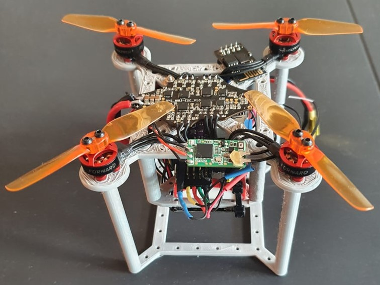

# Mini-Drone
Design of a Mini Drone for University of Cape Town EEE4022S final year project.

Original project description:
Ardupilot is a professional grade open-source autopilot software stack. This
project requires a student to design a mini-drone (<250g) running the Ardupilot
firmware. An example of analogous drones are linked below. In addition to
designing and building this drone the student must integrate an openflow sensor,
used to facilitate drones holding position by using input from a downwards facing
camera.

Original Deliverables:
1. A literature review briefly summarising drone autopilot software, currently
available mini-drones, recent work using openflow sensors for localisation
2. A functioning mini-drone
3. All design files for (2) including mechanical, electrical, and software build
instructions in a documented public git repository
4. A qualification of the performance of the resulting design
5. The final thesis report, poster, and presentation

## Specifications
- Quadracopter with optical flow sensor and range finder
- Cost: R 5273 (Excluding optical flow sensor, wires, shipping, compatible transmitter and 2S LiPo battery charger), price can be reduced with the replacement of the Pixracer for an Omnibus F4 Pro
- Uses Pixracer R15 flight controller/autopilot, running ArduPilot
- Take-off weight including battery: 107g
- Recommended payload capacity: 60g
- Flight Time with no additional payload: 7-8min hover
- Assembly and test flight time: 2-3hrs (once experienced)

## Getting started
Note: Some assembly tools as well as a means of 3D printing (PLA) are required for assembly.  All 3D printable models are available in [Mechanical Design](./Mechanical%20Design) as Fusion 360 design files, as well as stl files

All required components and suppliers are listed in the following [BOM](./Instructions/BOM.xlsx)

Build instructions are available [here](./Instructions/README.md)

Read through the written report to learn how the components were chosen. Available [here](./report.pdf)

